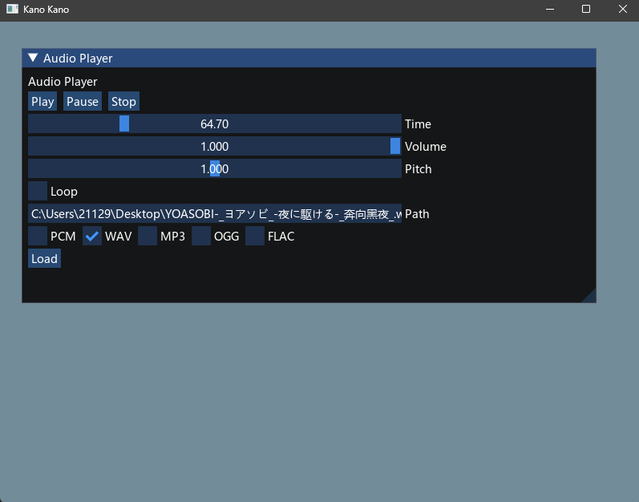

# Kano Audio

a simple library for decoding and playing audio files.  

```
supporting the following formats:

* MP3
* OGG
* WAV
* PCM (16 bit, 44.1kHz, stereo)
* FLAC (16 bit, stereo)
```
## Exmaple


## Usage

```c++
#include "KanoAudio/Audio.h"
#include "KanoAudio/MP3Decoder.h"
#include "KanoAudio/OGGDecoder.h"
#include "KanoAudio/WAVDecoder.h"

using namespace KanoAudio;

int main()
{
    auto audio = Audio::Create();
    audio->Load<MP3Decoder>("test.mp3");
    // audio->Load<OGGDecoder>("test.ogg");
    
    audio->Play();
    while (audio->IsPlaying())
    {
        Sleep(100);
        // ...
    }
        
    /*
    audio->Pause();
    audio->Stop();
    audio->SetVolume(0.5);
    audio->GetVolume();
    audio->SetLooping(true);
    ...
    */
    
    // if you not call this, the audio will be released when shared_ptr is destroyed.
    // but when openal shutdown, it will detect you not release the audio, and print a warning.
    // so better call this.
    audio->Unload();
    ShutdownOpenAL();
}

```

## Dependencies

```
Please install the following libraries in vcpkg or your own way:
* libogg (vcpkg install libogg)
* libvorbisfile (vcpkg install libvorbis)
* libmpg123 (vcpkg install mpg123)
* OpenAL (vcpkg install openal-soft)
* libflac (vcpkg install libflac)

if you want to use the examples, please install the following libraries:
* glfw3 (vcpkg install glfw3)
* glad (vcpkg install glad)
* imgui (vcpkg install imgui)
```

## TODO

```
* add more formats
* add more examples
* add more tests
* async loading
```